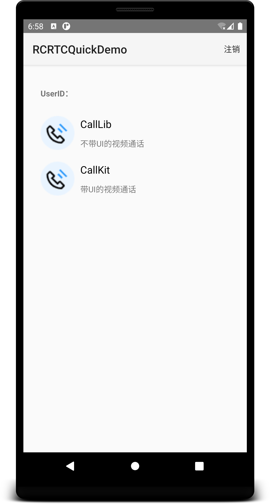

# 融云实时音视频 Android 示例

本代码仓库集合了融云实时音视频产品[音视频通话]、[音视频会议]、[低延迟直播]在 Android 端的示例代码，以便开发者体验产品，快速集成[融云实时音视频 Android 端 SDK]，实现单群聊、音视频通话、语音聊天室、娱乐直播、教学课堂、多人会议等场景需求。

<p align="center" style="background-color: #e1e5eb; padding: 10px; margin-top: 5px; margin-bottom:5px;">


</p>

如果想要直接下载 Android APK 体验各场景下应用功能，欢迎[前往融云官网下载各场景的示例应用](https://www.rongcloud.cn/downloads/demo)。

本仓库包含两个示例应用项目: 

1. [rtcapp](rtcapp): 集中演示融云实时音视频 Android SDK 支持的多个非呼叫业务场景与功能。
1. [callapp](callapp): 演示融云实时音视频 Android SDK 支持的含呼叫业务音视频通话场景与功能。

本仓库还包含多个组件: (module): 

1. [common](common): 含 AppServer 示例、通用 UI 功能函数。AppServer 支持获取 Token。
1. [meeting1v1](meeting1v1): 两人会议。
1. [live](live): 直播。支持观众之间音视频互动。
1. [screenshare](screenshare): 屏幕共享。
1. [calllib](calllib): 不带 UI 的呼叫功能展示。
1. [callkit](callkit): 带 UI 的呼叫功能展示。

## 前提条件

* 示例应用与组件目录下的 README 分别列出了具体的前提条件要求。
* 示例应用需要有 App Key 才能换取客户端连接融云服务器的身份凭证。请开通融云开发者账号，并在后台 [获取 App Key](https://developer.rongcloud.cn/app/appkey)。
* 使用 Android Studio 3.0 或以上版本。如果您尚未安装，请在 [官网下载](https://developer.android.com/studio/index.html) 并安装。
* Android SDK 4.4 或以上版本，即 minSdkVersion >= 19。
* Android Build Tools 21 或以上版本。为获得更好的编译体验，建议使用最新版。
* JDK 1.7 或以上版本。

## 设置设备

示例应用必须部署到搭载 Android 4.4 或更高版本的 Android 设备或 Android 模拟器。

* 如要使用 Android 设备，请按照在[硬件设备上运行应用](https://developer.android.com/studio/run/device.html)中的说明进行操作。
* 如要使用 Android 模拟器，您可以使用 [Android Studio 附带的 Android 虚拟设备 (AVD)](https://developer.android.com/studio/run/managing-avds.html) 管理器创建虚拟设备并安装模拟器。

## 运行示例应用

1. 克隆本存储库下载示例代码。
1. 在 Android Studio 中，选择 **Open an Existing project**。
1. 打开克隆下载的代码仓库，等待导入完成。
1. 在示例应用的 `DemoApplication.java` 中，填入从融云开发者获取的 App Key 与 App Secret。

    路径：**Project** 视图下 `<demo-app-name>/src/main/cn.rongcloud.demo`。

    ```java
    /**
    * TODO: 请替换成您自己申请的 AppKey
    */
    public static final String APP_KEY = "";
    
    /**
    * TODO: 请替换成您自己 AppKey 对应的 Secret
    * 这里仅用于模拟从 App Server 获取 UserID 对应的 Token, 开发者在上线应用时客户端代码不要存储该 Secret，
    * 否则有被用户反编译获取的风险，拥有 Secret 可以向融云 Server 请求高级权限操作，对应用安全造成恶劣影响。
    */
    public static final String APP_SECRET = "";
    ```

1. 在 Android Studio 顶部选择 `callapp` 或 `rtcapp`，点击运行。

## 文档

- [音视频通话文档]
- [音视频会议文档]
- [低延迟直播文档]

## 支持

源码地址 [Github](https://github.com/rongcloud/rtc-quickdemo-android)，任何问题可以通过 Github Issues 提问。

Demo 源码遵循 MIT 开源协议。

<!-- Reference links below -->

<!-- links to official website pages-->

[音视频通话]: https://www.rongcloud.cn/product/call

[音视频会议]: https://www.rongcloud.cn/product/meeting

[低延迟直播]: https://www.rongcloud.cn/product/live

[融云实时音视频 Android 端 SDK]: https://www.rongcloud.cn/downloads

<!-- links to docs -->

[音视频通话文档]: http://doc.rongcloud.cn/call/Android/5.X/demo

[音视频会议文档]: http://doc.rongcloud.cn/meeting/Android/5.X/demo

[低延迟直播文档]: http://doc.rongcloud.cn/live/Android/5.X/demo

<!-- links to ops -->

[获取 App Key]: https://developer.rongcloud.cn/app/appkey/
